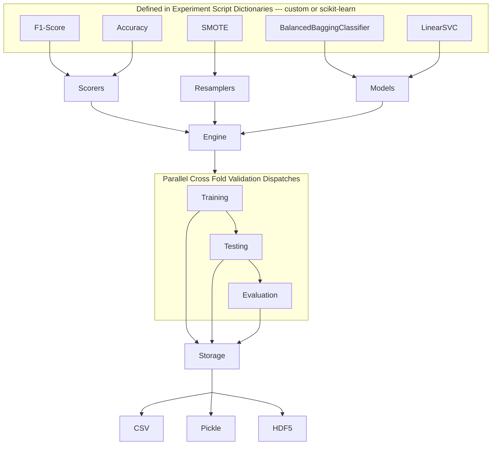

# CHML-Engine

## Model Analysis

All outputs can be loaded and analyzed using the scripts in [analysis.py](./analysis.py).  

### Output Definition
All artifacts created during the model training and testing processes are stored in the `results` directory until the next run of that specific configuration of model, resampler, and scorer.  The results directory is organized by the model, resampler, and scorer used in the experiment. The results folder can contain various files and structures depending on the type configured. Below several of these structures are described.

#### Pickle / DataFrame
The pickle file is a serialized version of a DataFrame object.  This file can be loaded into memory and used for post analysis. The DataFrame contains the predictions made by the model on the test data, the correct labels, and the input datapoints. The DataFrame also contains the configuration of the model, resampler, and scorer used in the experiment so that it can be reproduced later.
```
File --> results/<resampler>/<model>/<scorer>/results.pkl
Contents --> DataFrame[data_index, predictions, labels]
Metadata --> Dict[model, resampler, scorer]
```
Note: There is a DataFrame at the Resampler level that contains the result of resampling.  This is used for the post analysis process and the indices are referenced from each of result DataFrames.

#### CSV
The CSV file is a serialized version of the DataFrame object.  The structure and contents are identical to the Pickling process except that results files and the resampled data are stored in CSV format.  This is useful for post analysis and for sharing results.


# Process Definition

